# Elfacun Chess Interface Module

## Operation manual

### Table of contents:

1. [Powering the module](#powering-the-module)
2. [Startup and modes of Operation](#startup-and-modes-of-operation)
3. [Configure the module](#configure-the-module)
4. [Piece preparation](#piece-preparation)
5. [Piece programming](#piece-programming)
6. [Setting up the board](#setting-up-the-board)
7. [Play with Reversed board](#play-with-reversed-board)
8. [Moving pieces](#moving-pieces)
9. [Promotion](#promotion)
10. [Take back movements](#take-back-movements)
11. [Using with a DGT 3000 clock](#using-with-a-dgt-3000-clock)
12. [Lichess mode](#lichess-mode)
13. [Using Elfacun with Picochess](#using-elfacun-with-picochess)
14. [Connecting via USB](#connecting-via-usb)
15. [Connecting via Bluetooth](#connecting-via-bluetooth)
16. [Connecting via BLE](#connecting-via-ble)
17. [Adjusting buzzer volume](#adjusting-buzzer-volume)
18. [Update Elfacun Software](#update-elfacun-software)
19. [Using Elfacun with Graham O'Neill drivers](#using-elfacun-with-graham-oneill-drivers)

### Powering the module

Once inserted into the board, there are two major possible configurations to power the module:

In __standalone mode__, you will have only Elfacun plugged into the board. You need to __power the module from its USB port__, regarless of if you are connecting an app via USB or you aren't. The module can be powered from a computer USB port as well as from a regular USB wall adapter. You can also have the board powered if you want to, but power from the board won't be used by the module.

In __passive mode__ you will have Elfacun plugged alongside an original module. In that situation you will need __both, power from Elfacun USB port and powering the board__ as you would regulary do to operate the original module. Be sure that you start the original module before you start Elfacun, because it will need to detect that the original module is operating to be able to enter in this special mode. If you start Elfacun before starting the original module, both will be trying to scan the board at the same time and neither will work properly.

There are some Mephisto boards (identified as type 4b in the schach-computer.info wiki) that aren't voltage-regulated and put the full wall adapter voltage into the modules. I don't recommend using Elfacun with those boards powered, as it will have to support an unknown voltage and cannot be guaranteed to work or not to be damaged. More information about the boards power supplies can be found here: [https://www.schach-computer.info/wiki/index.php?title=Stromversorgung_Mephisto_Modulare_Reihe](https://www.schach-computer.info/wiki/index.php?title=Stromversorgung_Mephisto_Modulare_Reihe)

### Startup and modes of Operation

The module can be started in three different modes:

* __Mode A__, compatible with most apps (except Millennium-compatible apps via USB)
* __Mode B__, compatible with most __Millennium-compatible__ apps, including USB
* __Lichess mode__

The main difference between modes A and B is that in mode A the serial port is initialized to 9600 bauds, while in mode B it is initialized to 38400 bauds. If you are using the module with Bluetooth or BLE, all the apps should work the same on mode A, as the appropiate protocol will be automatically detected.

So it is recommended to start the module on mode A unless you want to use __Millennium-compatible apps via USB__, in wich case mode B is mandatory.

The default mode can be changed by the user (see "Configuration"). If you want to boot the module in a non-default mode you can make so by __keeping pressed while starting__ one or more of the module buttons:

* Keep pressed __first button__: Start in __mode A__
* Keep pressed __second button__: Start in __mode B__
* Keep pressed __third button__: Start in __Lichess mode__

Additionally you can keep pressed the following buttons to modify sound and LED operation

* Keep pressed __fifth button__: Start with __board LEDs disabled__
* Keep pressed __sixth button__: Start with __sound disabled__

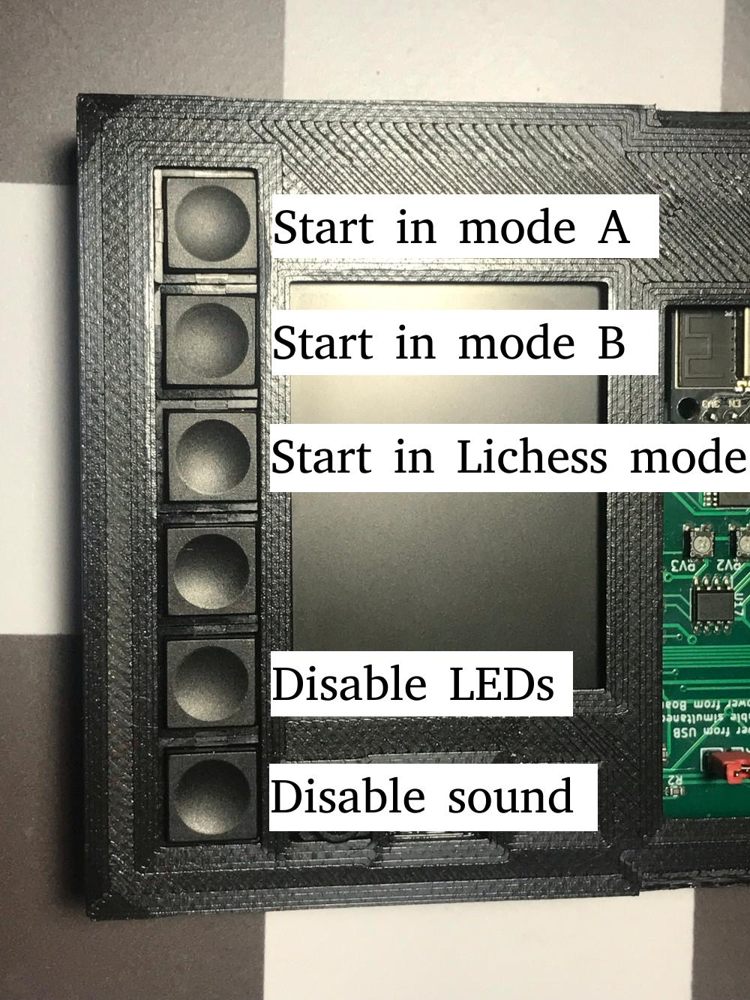

### Configure the module

You can make permanent changes to the module configuration by editing a [settings.txt](./settings.txt) text file, putting it into the SD card and starting the module with the card inserted. When started, the values from the file will be permanently stored in the module.

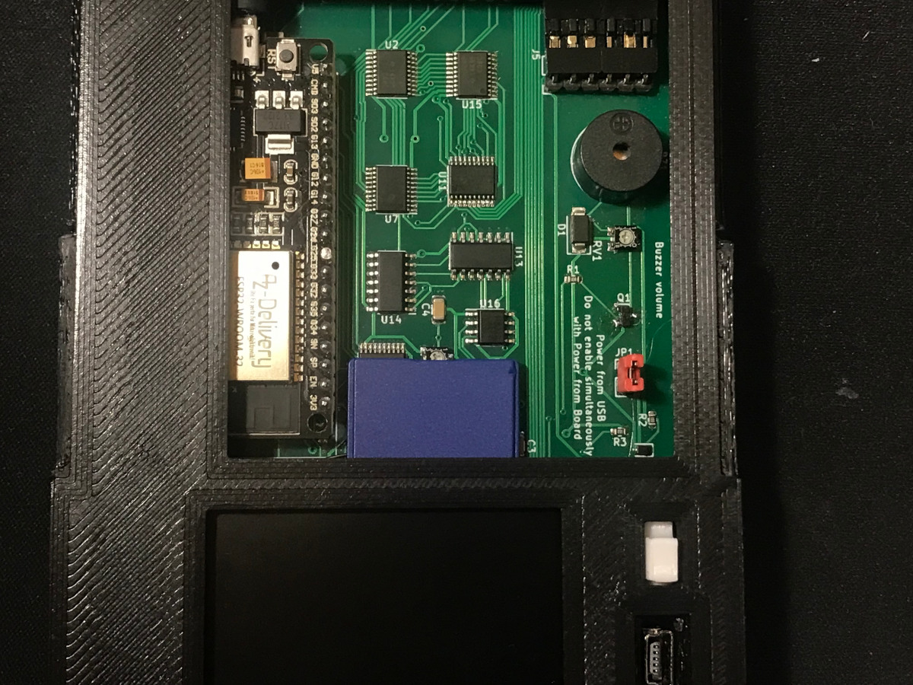

__The piece scanning won't work while the SD card is inserted, so please remove the card after successfully configuring the module.__

A minimal configuration is needed if you want to use Lichess mode, that is your WIFI ssid and credentials, and your Lichess API token.

The values you can edit in that file are:

* __base.mac.address__: If you want to change the hardware address of the module
* __mode.default__: default mode
* __mode.a.bt.advertised.name__: The name you will see when pairing the module via Bluetooth in mode A
* __mode.b.bt.advertised.name__: The name you will see when pairing the module via Bluetooth in mode B
* __buzzer.enabled__: Enable or disable sound by default
* __leds.enabled__: Enable or disable the board LEDs by default

Some parameters that modify how Elfacun identifies itself in mode A:

* __mode.a.trademark__
* __mode.a.version.major__
* __mode.a.version.minor__
* __mode.a.clock.version.major__
* __mode.a.clock.version.minor__
* __mode.a.serial.number.long__
* __mode.a.serial.number.short__

Settings needed for Lichess mode, see Lichess Mode manual section for more information

* __lichess.wifi.ssid__
* __lichess.wifi.password__
* __lichess.wifi.authtoken__
* __lichess.board.autoinvert__

Settings to customize each of the 6 pre-defined challenges for Lichess. When in Lichess.TV you can launch one of those predefined challenges using the corresponding key (the first key is the leftmost one).

* __lichess.mode.X.time__
* __lichess.mode.X.increment__
* __lichess.mode.X.color__
* __lichess.mode.X.rated__

A more detailed description and a list of valid values for each parameter are included in the sample [settings.txt](./settings.txt) file

When you edit _settings.txt_, do not leave spaces between the keys, equals and values. This is OK:

    lichess.board.autoinvert=false

This is NOT OK:

     lichess.board.autoinvert = false

_While experimenting with Lichess settings, I recommend you have at hand a connected app or the session initiated on the web site, as if you launch challenges repeatedly and don't to play the games, you could be temporarily banned._

### Piece preparation

This is optional and only required if you want to be able to scan your pieces with the module.

You have been provided with 50 RFID tags that can be programmed and read by the module. You need to modify your pieces to place one tag under each piece.

In case you want to buy more tags, the tag specification is __NTAG213, 18mm diameter__.

The provided tags are 18mm. wide, so they are a good fit for the Exclusive and München original pieces, but maybe a little big for the Modular pieces, specially for the pawns.

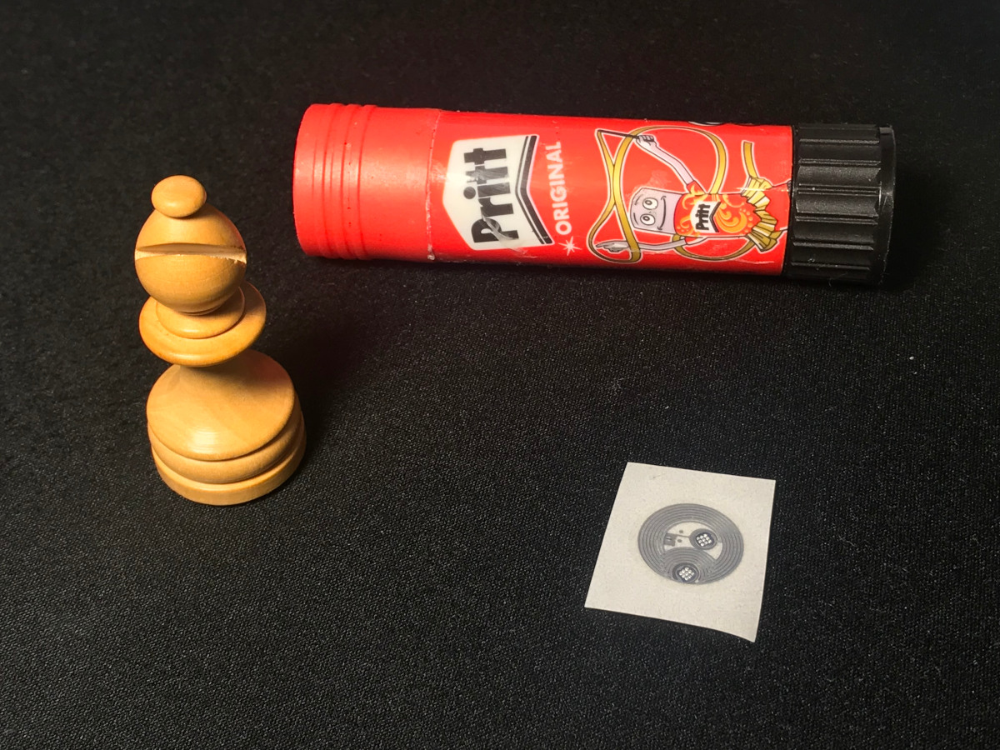

For fitting the tags you need to remove the felt under your piece. If you are careful you will be able to glue back the same felt later. You can use something like a small flat screwdriver to gently pull the felt in little steps without shredding the felt or damaging the piece.

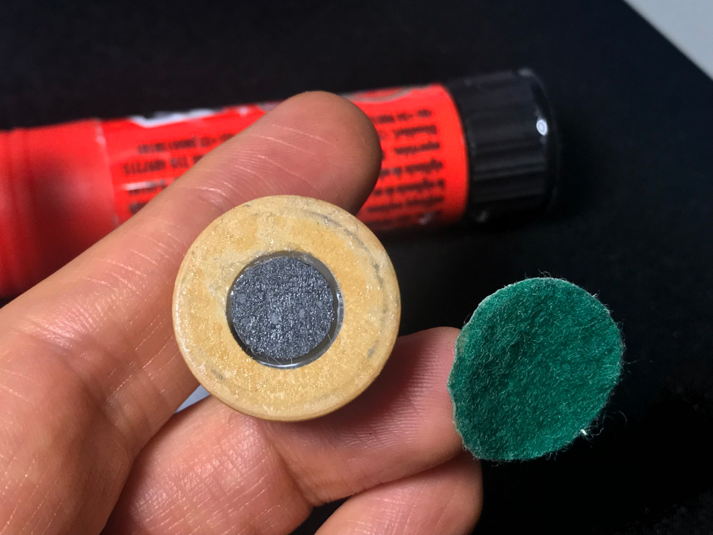

With the felt removed, stick one tag under the piece. The tags are auto-adhesive.

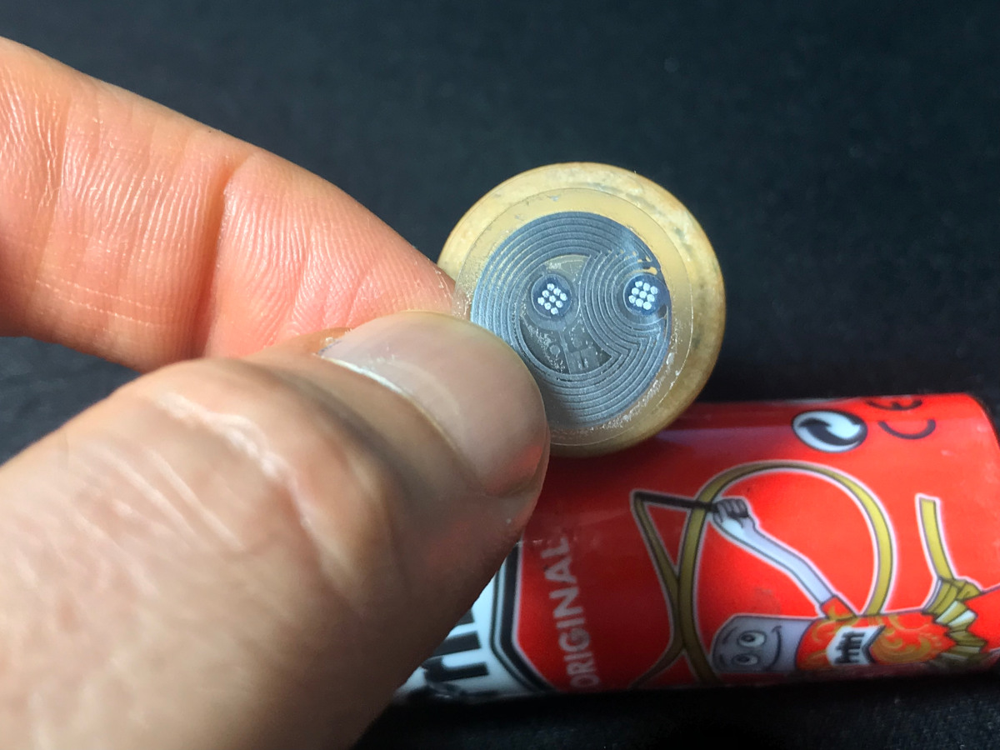

Finally glue the felt back under your piece, and that piece is ready to be used with the module. Of course you can also replace the old felt with new felt if you want to.

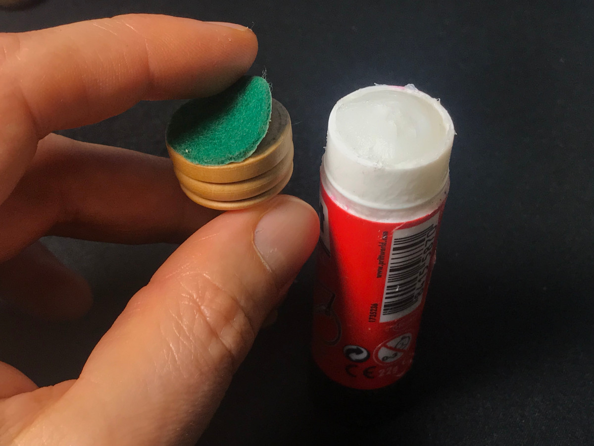

### Piece programming

Once you pieces have been RFID-equipped, place them in the regular stating position on the board and switch on the module. Once the module is started, take one piece and place it near the module. You will hear a triple beep sound that indicates that the piece has been programmed. Place the piece back into its position and repeat the operation with the other 31 pieces.

This procedure needs to be done only once as the tags keep their programming forever, but the tags can be programmed as times as you want.

You can test the piece programming by clearing the board, taking a piece, placing it near the module, then you will hear a single beep sound that indicates that the piece has been scanned. Then place it on the board and the correct piece should show up on the screen.

### Setting up the board

When you start the module, if the pieces are placed in the regular starting position the module will recognize them all, and you can play normally from there.

Anytime the module detects that all the 32 pieces are in the 1st,2nd,7th and 8th rows, it will assume that you are setting up the starting position and recognize all the pieces, and you can play normally from there.

Anytime the module detects that there are no pieces outside the 1st,2nd,7th and 8th rows, and you are placing more unknown pieces in the 1st,2nd,7th and 8th rows, after 4 unknown pieces have been placed it will assume that you are setting up a starting position, and the pieces will be automatically recognized from that point on.

Of course you can set-up a different position by clearing all the board, taking one piece, scanning it and placing it on the board. Repeat the operation with as many pieces as you want to set-up the complete position.

### Play with Reversed board

To play with a reversed board (play with black pieces in the first rows) place the pieces normally on the board with the black pieces in front of you. Then take the two kings off the board and place them back. The board will then be reversed and that will be shown on the screen, and you can play normally from there.

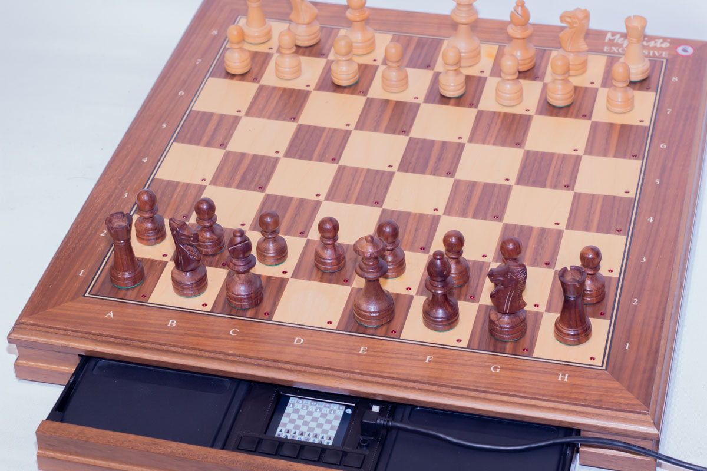

### Moving pieces

Try to place the pieces as centered as possible in its squares. This is a general requirement for Mephisto boards.

The module will make a beep sound everytime you lift a piece and everytime you place a piece. If you play logical movements it will always identify correctly the piece at its destination square and show it accordingly on the screen.

Piece slide is not recommended at this point, you should always lift and place the pieces you move. Future updates could allow or improve piece sliding support.

For taking pieces it is irrelevant if you lift first the taking or the taken piece, it will work both ways.

### Promotion

When promoting a pawn to a queen, advance the pawn to the last row and then take it off the board and place the queen (or any other piece that will act as a queen) in its place.

When promoting a pawn to a piece diffent than a queen, advance the pawn to the last row and then take it off the board. Then you need to scan with the module the piece you want to promote to. Take that piece and place it on the module, you will hear a beep sound to indicate that it has been scanned. Then place it on the board in the appropiate square.

When promoting a pawn to a piece diffent than a queen in a situation where you don't hava a piece to scan (for example, to promote to a knight when you already have your two knights on the board) you can temporary take a similar piece to scan (in the example one og your knights), scan it, place it back and then place any other piece instead of the promoted pawn. That other piece will act as the desired piece.

### Take back movements

The module will detect all the played movements and you will be able to take them back. When taking back a capture, complete first the back movement and then place the taken piece back. The taken piece will appear on the screen when you complete then back movement to indicate it has to be placed on the board. Be careful not to misplay any back movement, as the module may lose track of the movements in that case.

### Using with a DGT 3000 clock

You can use a DGT-3000 clock with DGT-compatible apps like Picochess. With Elfacun turned off connect the clock to the module using a stereo mini-jack to mini-jack cable. Shorter cables are recommended as the I2C signal will not work with longer cables. Someting like a 50cm cable will work. Someting like a 2m cable won't work. Something in between may or may not work.

When you turn on the module, the clock will be automatically detected and used with the apps.

To indicate the correct clock orientation, the clock lever should be up at white's side at module startup. This cannot be changed when the module is already started. If you play with a [reversed position](#play-with-reversed-board) the clock times will be automatically switched to the righ side.

The clock buttons will be functional, as well as the module buttons emulating the clock buttons.

The first 5 module buttons (stating on the leftmost) emulate the 5 DGT-3000 front buttons. The sixth module button emulates the clock lever (changes the lever position with every button press).

If you don't plug a real DGT-3000 clock, the module will emulate one while in mode A. The module buttons will be fully operational and messages and times will be shown on the screen.

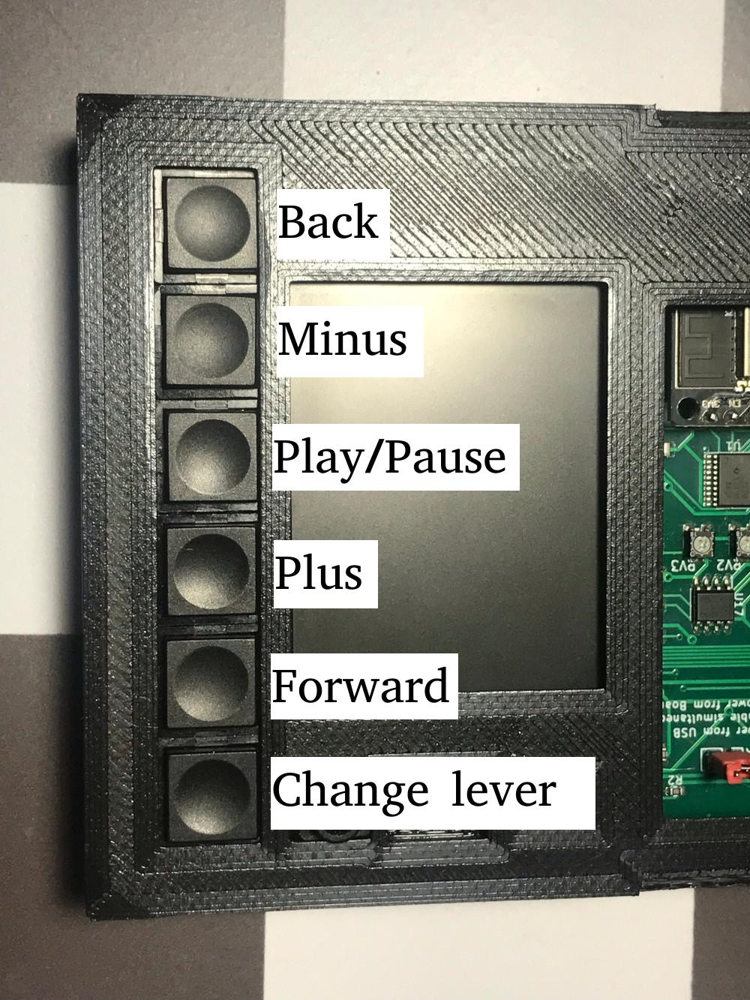

### Lichess mode

To use Lichess mode you will need to generate an authentication token in the website.

Log into lichess.org and enter into your "preferences" menu option:

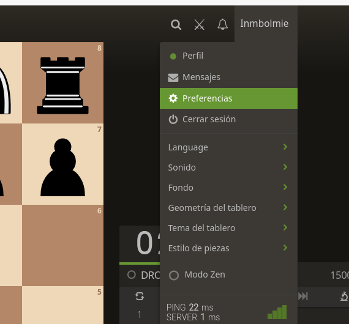

On the side menu select "API access tokens"

Click on "generate a personal access token"

Give the token access to the following features:

* Read preferences
* Read incoming challenges
* Create, accept, decline challenges
* Play Games with the board API

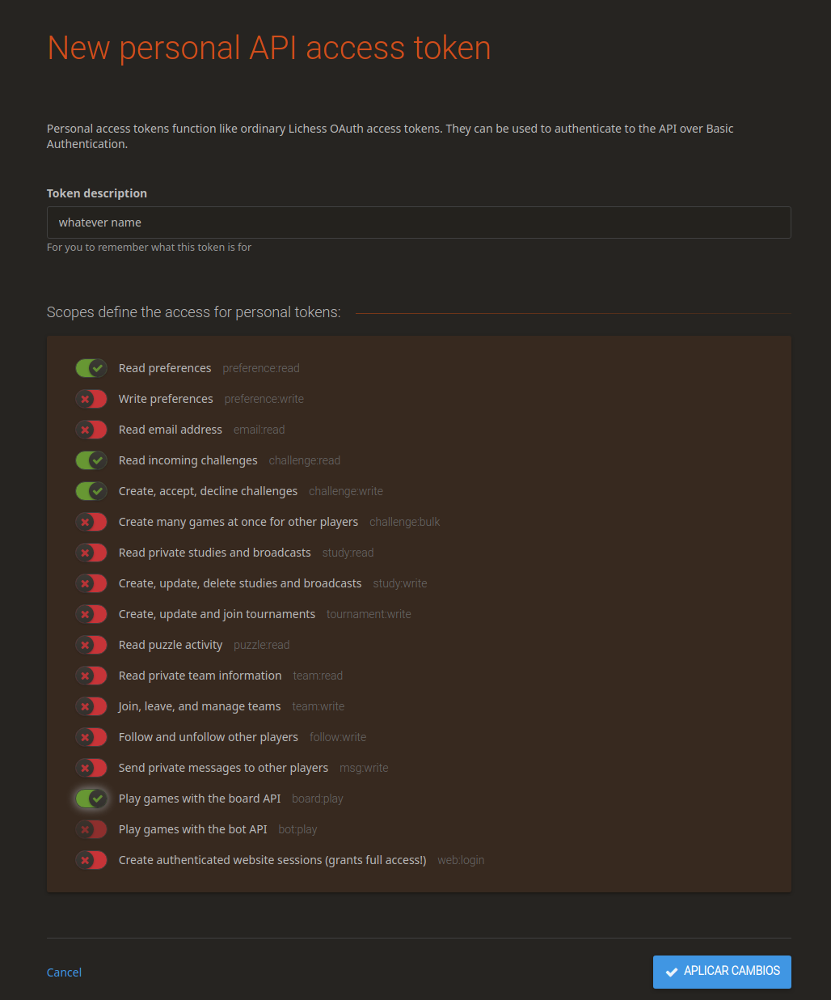

Press "apply" and now you have generated your access token, that you will have to copy into Elfacun configuration. Make sure you write it down somewhere as you won't be able to see it again on the website.

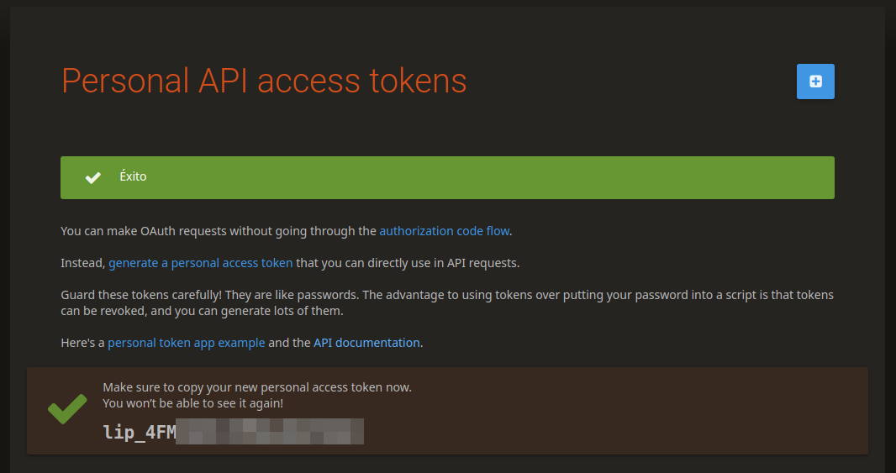

Now that you have a token, you will have to configure it [using the _settings.txt_ file in a SD card](###Configure-the-module). The mandatory parameters for Lichess mode are:

* __lichess.wifi.ssid__: Your WIFI ssid
* __lichess.wifi.password__: Your WIFI password
* __lichess.wifi.authtoken__: Authentication token generated from your lichess.org account
* __lichess.board.autoinvert__: If board will be automatically inverted when you play as black

After configuring that parameters, when starting in Lichess mode, the module will automatically connect and start streaming Lichess.tv games. The stream will continue until a new game is detected. A new game can be started by:

* Starting a game outside the module, for example on the web or in a mobile app.
* Launching a challenge from the module.

You can launch a challenge from LichessTV pressing twice one of the six module buttons. Every button represents one play mode that can be configured by the user via _settings.txt_ and SD card.

For example, to configure the first button to lauch a rated 10+0 game as rando color you will configure in _settings.txt_:

    lichess.mode.X.time=10
    lichess.mode.X.increment=0
    lichess.mode.X.color=random
    lichess.mode.X.rated=true

If you pressed one button but don't want to launch the challenge, simply press a different button to cancel.

After the challenge is launched, if is successfully paired the game will be automatically detected and started.

While in a game, you can control with the module buttons some actions:

* __Fourth button__: Ask the opponent for __taking back__ the las movement.
* __Fifth button__: Offer draw to the opponent.
* __Sixth button__: __Resign__.

You need to push the button twice for the action to be effective.

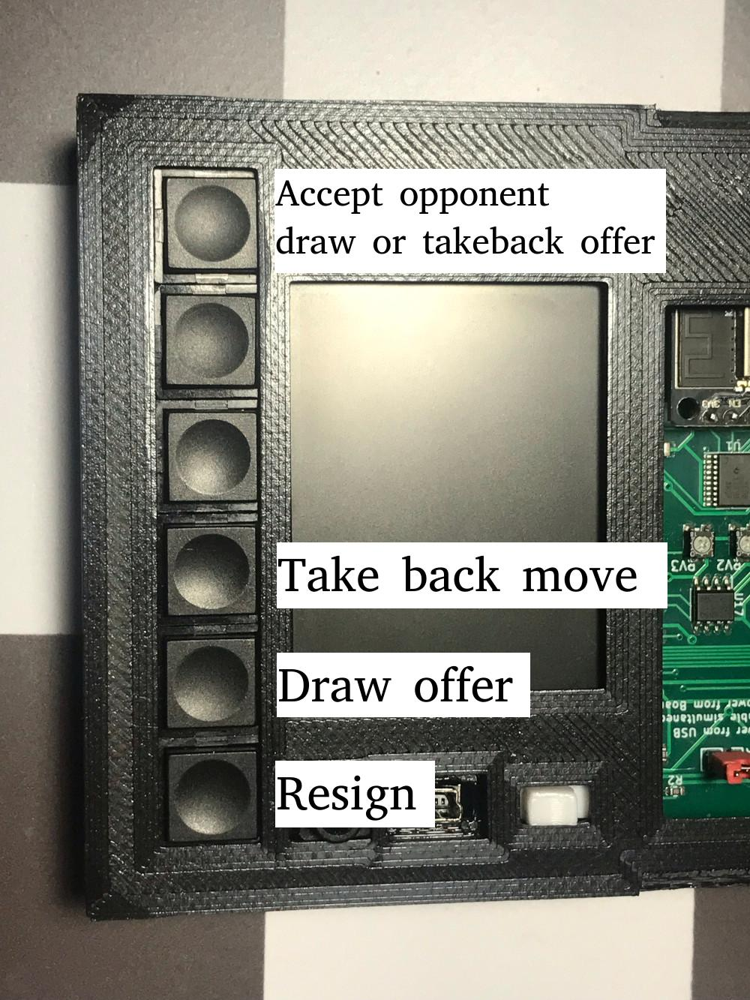

The opponent draw and takeback offers will be shown on the screen as well. You can accept them using the first button or decline it with any other button or making a piece movement.

When a game ends, the module will show the result and LichessTV mode will automatically start again.

_While experimenting with Lichess settings, I recommend you have at hand a connected app or the session initiated on the web site, as if you launch challenges repeatedly and don't to play the games, you could be temporarily banned._

### Using Elfacun with Picochess

We will show how Picochess can be configured to connect to Elfacun using Bluetooth. A Raspberry pi 3B+ or 4 is recommended for running Picochess. Of course you can also connect Elfacun to picochess using USB.

For this test an image of Picochess V3 on a Raspberry PI 3B+ has been used.

[https://groups.google.com/g/picochess/c/jCuWSm0EDH8?pli=1](https://groups.google.com/g/picochess/c/jCuWSm0EDH8?pli=1)

You will need access to a Picochess command line, you can get it on its desktop, or remotely via VNC or SSH.

First you need to know the module MAC address. With Elfacun started in mode A, open a console in Picochess and execute the following command:

    sudo hcitool -i hci0 lescan

Here you see that Elfacun MAC address is 24:62:AB:F3:45:2E. The address will be different on each Elfacun module.

Into the same console execute the following command where you need to indicate your module MAC address.

    sudo rfcomm bind 0 XX:XX:XX:XX:XX:XX

For example if your module MAC were 11:22:33:44:55:66 you would need to execute:

    sudo rfcomm bind 0 11:22:33:44:55:66

    

And now Picochess should detect the module, if it isn't, restart picochess

  

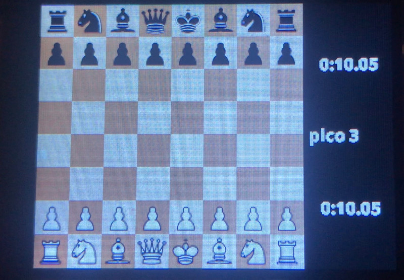  

If you want Revelation-II leds to be enabled you need to make a small code modification in Picochess.

Open a text editor with _vi_ or the text editor of your choice and edit this file:

    /opt/picochess/dgt/board.py

You need to modify this line so that self.is_revelation = True and self.is_pi = True

  

  

Once modified, save the file and restart Picochess, and now Revelation II LED support should be enabled and the computer movements will be indicated on the board.

### Connecting via USB

No special configuration is needed. Simply start the module in mode A or B depending on the protocol you want to use.

On windows machines you may need to install the USB-to-serial driver for the ESP32. If so, follow the instructions here to install it: [https://docs.espressif.com/projects/esp-idf/en/latest/esp32/get-started/establish-serial-connection.html](https://docs.espressif.com/projects/esp-idf/en/latest/esp32/get-started/establish-serial-connection.html). For the ESP32 boards I've been using so far, the relevant driver is the CP210x driver.

### Connecting via Bluetooth

We will show an example of how to configure a Bluetooth connection in LucasChess Windows. The configuration for Rabbitplugin or other programs should be similar.

Open the Bluetooth configuration and push the button to add a new device. Start Elfacun in mode A.

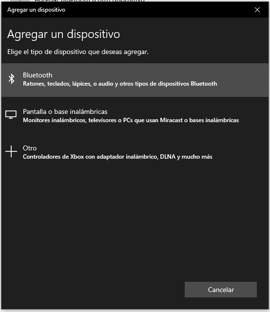

The module should appear on the list of detected devices. If more than one device appears it should be that one marked with a "computer" icon

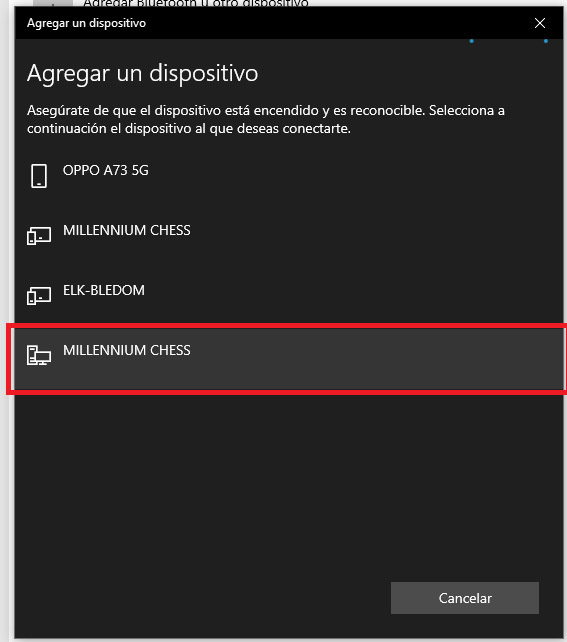

Push the device to add it.

Now that the module has been paired, a couple of serial ports should have appeared in the device manager under "COM and LPT ports" section. One of those ports is the port you have to indicate in the driver configuration.

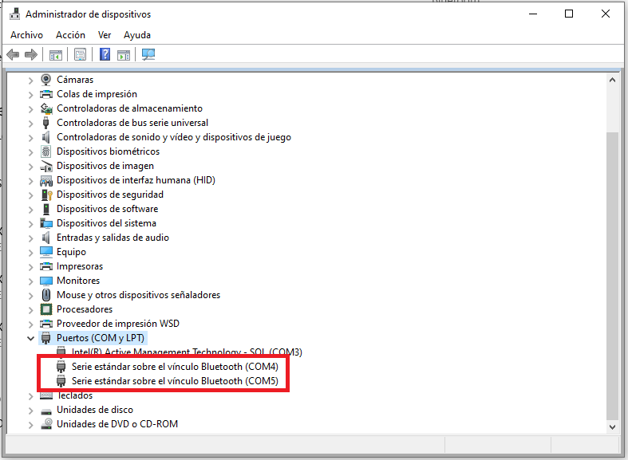

Once we have configured the port in LuchasChess it detects the module and it is ready to go.

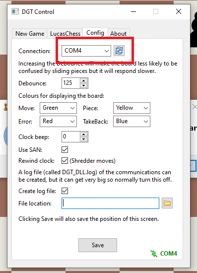

### Connecting via BLE

Using Elfacun with BLE connectivity cannot be easier. Just turn on the module in mode A or mode B and the module will be detected by any compatible application. Be warned that some applications expect the module to identify with a specific Bluetooth name. The name that the device uses to identify itself can be configured by the user.

### Adjusting buzzer volume

The buzzer volume can be modified adjusting the variable resistor RV1. It can also be entirely turned off via configuration. The resistor is a little tricky to adjust as it is very sensitive, so it can be difficult to get it to the desired volume.

### Update Elfacun Software

You can update the module software putting an update file into an SD card, inserting the SD into the module and turning the module on.

It is recommended that the module is not inserted into the board for the update, you only need to power it up from the USB cable.

__Make sure the SD card you are using is NOT write-protected__.

Download the update file and place it in the root directory of the SD card. The update file name will be something like _update_0x6ee0d617.bin_. Make sure you download the file in its entirety.

Insert the SD card into its slot behind the module screen with the contacts facing upwards like this:

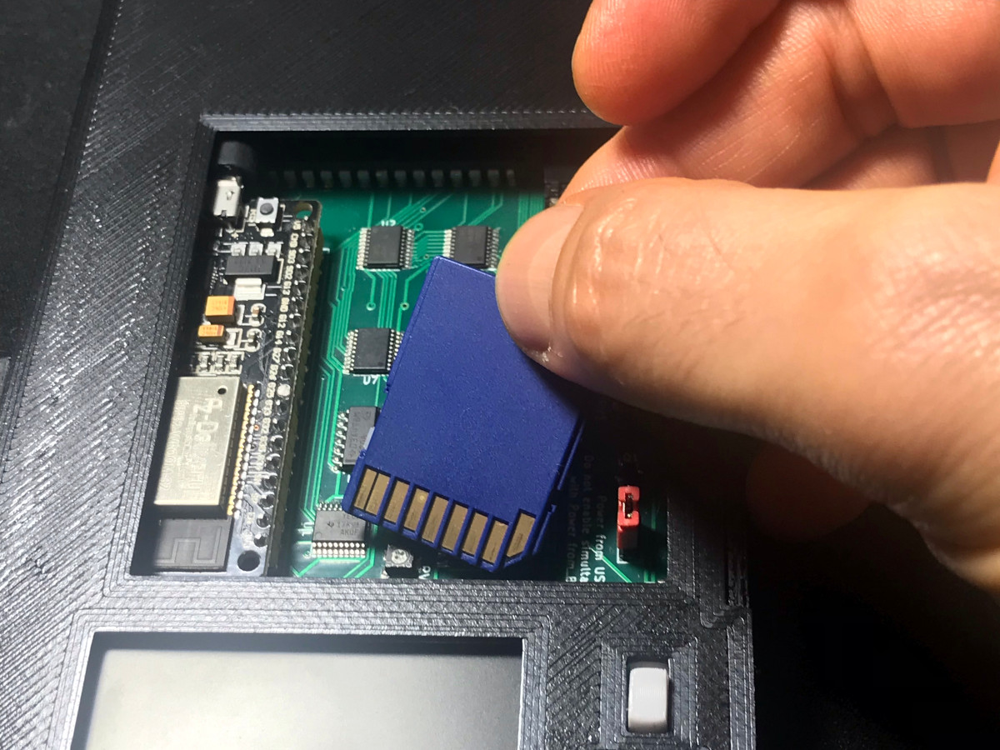

Plug the USB cable and turn the module on, if the module finds an update file into the SD card it will check it for integrity. If the integrity check failes make sure you download the correct file in its entirety. The checking process will take some time.

If the update file is correct, you will be prompted to confirm the update. To do so press __simultaneously__ the two leftmost module buttons. The update process will begin.

__While updating please, do not turn off the module or remove its power, as you can brick the module doing so__.

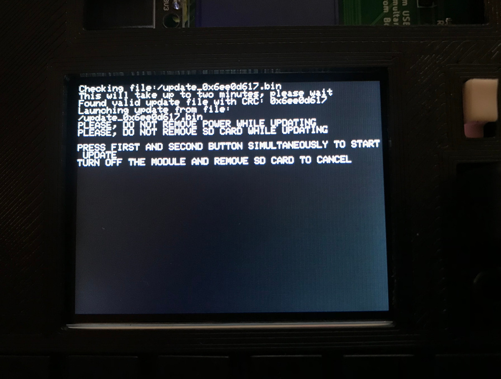

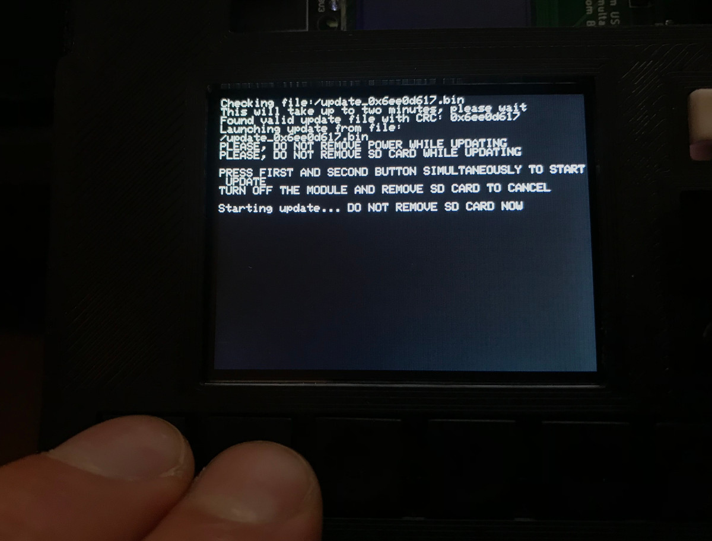

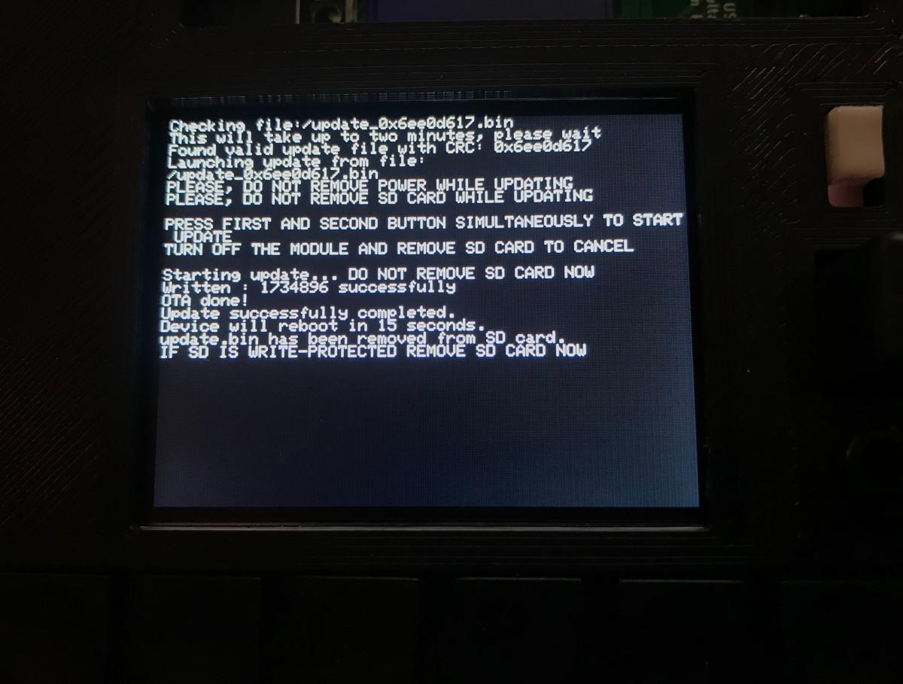

When the update is finished, the module will remove the _update.bin_ file from the SD card, and reboot after 15 seconds. Now you can remove the SD card and use the updated module normally.

Be careful when removing the card, as it is a tight fit and can take some time. Pull it backwards in small steps grabbing it from the sides.

The SD card should not be left inserted into the module, as it could prevent the RFID reader from operating correctly.

### Using Elfacun with Graham O'Neill drivers

Elfacun is compatible with Grahan O'Neill drivers via USB, Bluetooth and BLE. You can get them here:

[https://goneill.co.nz/chess.php](https://goneill.co.nz/chess.php)

_"DGT", "Millennium" and "Mephisto" are trademarks of their respective owners.
All the trademarks are used nominatively to indicate compatibility, and do not indicate affiliation to or endorsement by the trademark owners._
